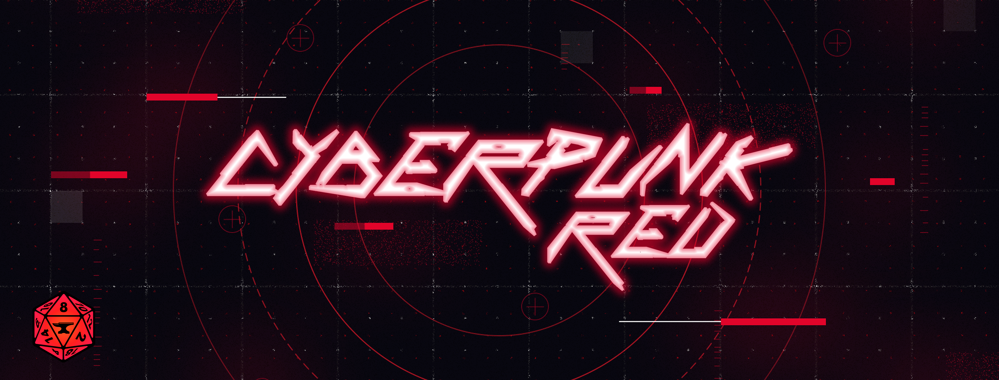

# Cyberpunk RED - Welcome to The Street!

<!-- markdownlint-disable-next-line MD033 -->

<!-- markdownlint-disable-next-line MD033 -->

An implementation of the Cyberpunk RED Core rules for Foundry VTT.

> Disclaimer: This game system is unofficial content provided under the [Homebrew Content Policy](https://rtalsoriangames.com/homebrew-content-policy/) of R. Talsorian Games and is not approved or endorsed by RTG. This content references materials that are the property of R. Talsorian Games and its licensees.

This project is in ongoing development, so while we hope you have a bug free experience that is by no means guaranteed. If you do find any bugs or have any suggestions to improve the system please do get in [touch](https://gitlab.com/cyberpunk-red-team/fvtt-cyberpunk-red-core/-/issues/new); we aim to be responsive and hope we can make it even better with your help.

## Getting Started

If you are a GM or player and curious about how Cyberpunk runs in Foundry VTT, why not check out our extensive [wiki](https://gitlab.com/cyberpunk-red-team/fvtt-cyberpunk-red-core/-/wikis/home), or Tales From Trantor's Cyberpunk RED [playlist](https://www.youtube.com/playlist?list=PL4-W5wKEr1fm57F9qnF8a7opYJ1pBt36X).

## Installing

The recommended installation method is with the usual FoundryVTT installer. You can find a tutorial for using that [here](https://foundryvtt.com/article/tutorial/).

<!-- markdownlint-disable-next-line MD034 -->
Our system can be found here: https://foundryvtt.com/packages/cyberpunk-red-core

<!-- markdownlint-disable-next-line MD034 -->
Alternatively you can grab the manifest directly here: https://gitlab.com/api/v4/projects/22820629/packages/generic/fvtt-cyberpunk-red-core/latest/system.json

## Release Notes

The latest changes can be found on our [changelog](https://gitlab.com/cyberpunk-red-team/fvtt-cyberpunk-red-core/-/blob/master/CHANGELOG.md).

If you want a sneak peak of what is coming in the next update, you can check out the [development changelog](https://gitlab.com/cyberpunk-red-team/fvtt-cyberpunk-red-core/-/blob/dev/CHANGELOG.md).

## Join the Community!

You can find our main community on [Discord](https://discord.gg/p5zYEQTV2R), where GMs and players alike talk about the project and Cyberpunk RED more widely. We'd love to see you there!

If you'd like to get in touch with someone specific, our contact information can be found on the wiki [here](https://gitlab.com/cyberpunk-red-team/fvtt-cyberpunk-red-core/-/wikis/home#project-red-cast-of-characters).

Interested in helping out? We would love to hear from you! We also coordinate our work on [Discord](https://discord.gg/p5zYEQTV2R), so head on over there and say hello.

If you'd like to get a sense of the project's direction, the tools we use, and how we're organized, our [Development Documentation](https://gitlab.com/cyberpunk-red-team/fvtt-cyberpunk-red-core/-/wikis/home#development-documentation) is a great place to start.

---

<!-- markdownlint-disable-next-line MD033 -->

<b><i>
Stay safe out there choom!
<!-- markdownlint-disable-next-line MD033 -->
</i><b>

